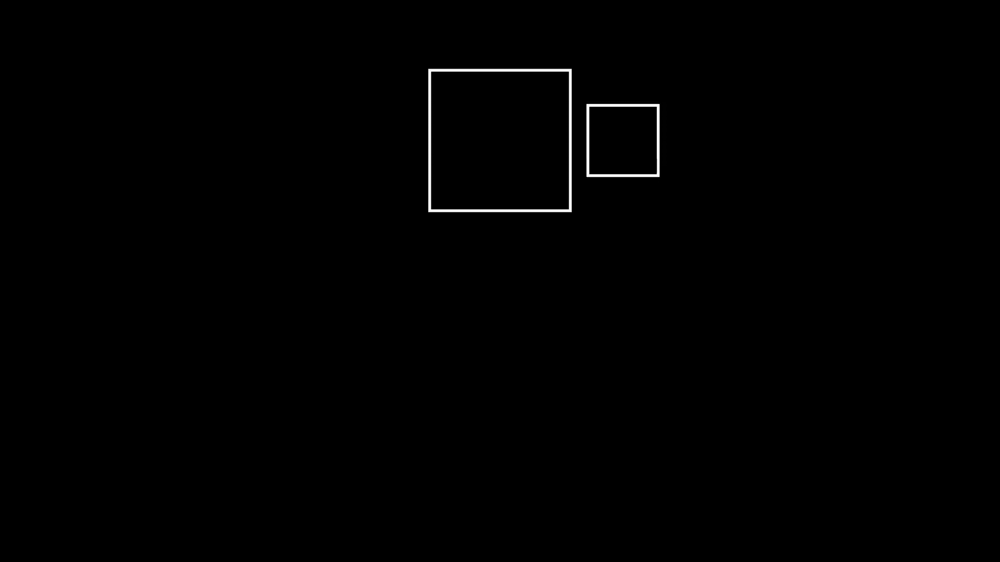
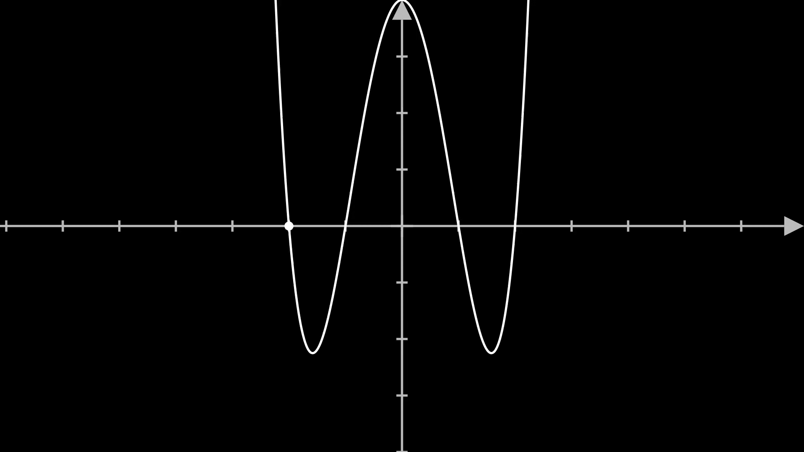
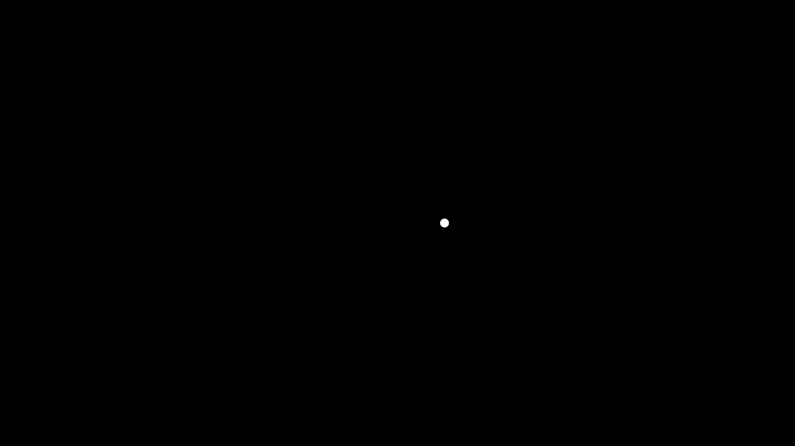
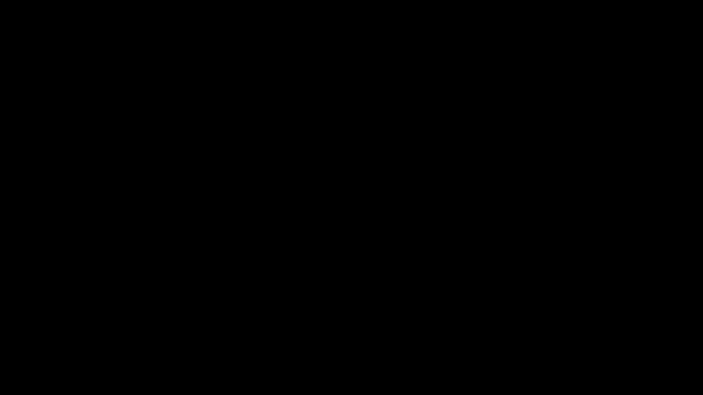
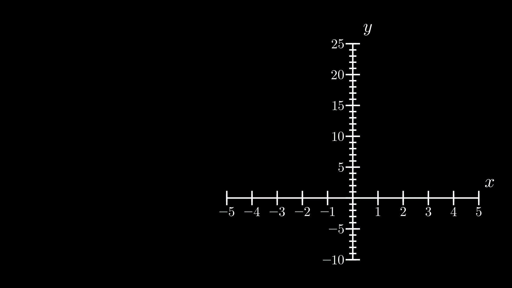
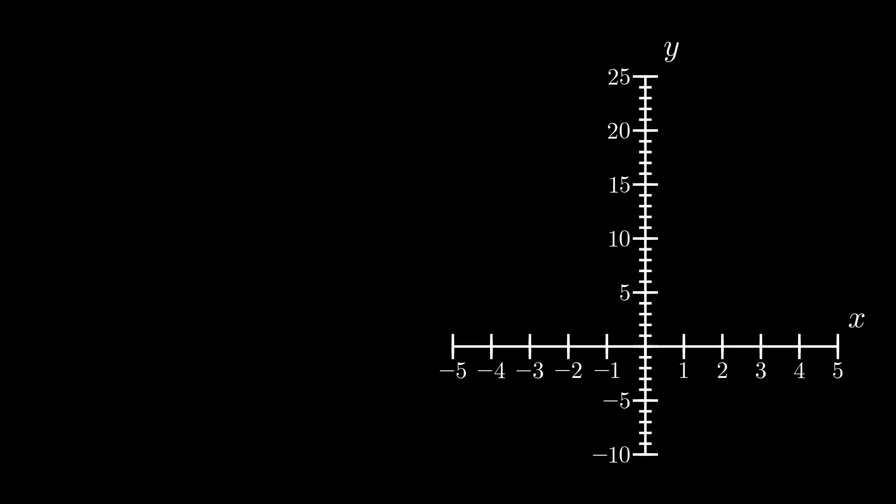

# add_updater

## Manim lesson on updaters

Updaters will allow you to run a piece of code on each frame. Updater are executed after the animation.

```py
from manim import *
class Example(Scene):
    def construct(self):
        square = Square()
        square.shift(UP* (config["frame_y_radius"] - 2))
        self.add(square)

        child = Square().scale(0.5).next_to(square, RIGHT)
        self.add(child)

        ## define updater first then give it an action
        child.add_updater(lambda mob: mob.next_to(square,RIGHT))

        self.play(square.animate.shift(DOWN * (config["frame_y_radius"] -2 )))
```



```
# multiple updater
t = DecimalNumber()
t.add_updater(lambda mob: mob.next_to(square,RIGHT))
t.add_updater(lambda mob: mob.set_value(square.get_center()[1]))
```

## Using sobmobject concept

Child object have same effect what parent object imposes

```py
square.add(child)
self.play(square.animate.shift(DOWN * (config["frame_y_radius"] -2 )))
```


## MoveAlongCurve

```py
class MoveAlongCurve(Scene):
    def construct(self):
        a = Axes()
        self.add(a)

        func = lambda x: (x+2)*(x+1)*(x-2)*(x-1)
        g = a.get_graph(func)
        self.add(g)

        def move_along_curve(mob,dt):
            new_x = mob.get_center()[0] + dt
            mob.move_to(a.coords_to_point(new_x,func(new_x)))

        d = Dot().move_to(a.coords_to_point(-2,func(-2)))
        d.add_updater(move_along_curve)
        self.add(d)

        self.wait(4)
```



```py
## Another implement
v = ValueTracker(-2)
def move_along_curve(mob,dt):
    mob.move_to(a.coords_to_point(v.get_value(),func(v.get_value())))

d = Dot().move_to(a.coords_to_point(-2,func(-2)))
d.add_updater(move_along_curve)
self.add(d)
self.play(v.animate.set_value(3),run_time=3)
```

## LissajousCurve

To make the curve smooth increase the `run_time`

```py
class LissajousCurve(Scene):
    def construct(self):

        def lissajous_position(t):
            A = 1
            B = 1
            a = 1
            b = 1
            delta = 1
            x = A * np.sin(a*t + delta)
            y = B * np.sin(b*t)
            return np.array([x,y,0])

        v = ValueTracker()
        line = VMobject()

        def update_dot(mob,dt):
            ## dt is cumulative hence use ValueTracker
            new_position = lissajous_position(v.get_value())
            d.move_to(new_position)
            ## each frame add
            line.add_line_to(new_position)

        d = Dot()
        d.move_to(lissajous_position(0))
        d.add_updater(update_dot)
        self.add(d)

        line.points = [d.get_center()]
        self.add(line)

        self.play(v.animate.set_value(10),rate_func=linear)
        self.wait()
```



# Calculus

## Limit

```py
class Derivative(GraphScene):
    def __init__(self,**kwargs):
        GraphScene.__init__(
            self,
            x_min=-1,
            x_max=10,
            y_min=-1,
            y_max=6,
            graph_origin=[-4,-2,0],
            **kwargs
        )

    def construct(self):
        self.setup_axes(animate=True)
        func = lambda x : 0.1 * (x - 2) * (x - 8) * (x - 5) + 3
        func_graph = self.get_graph(func,x_min=0.8,x_max=9)
        x_start = 3
        x_end = ValueTracker(7)
        dot_start = Dot(self.coords_to_point(x_start,func(x_start)))
        dot_end = Dot(self.coords_to_point(x_end.get_value(),func(x_end.get_value())))

        def dot_updater(dot):
            x = x_end.get_value()
            dot.move_to(self.coords_to_point(x,func(x)))

        dot_end.add_updater(dot_updater)

        line = Line(dot_start.get_center(),dot_end.get_center())

        line.add_updater(
            lambda x : x.become(
                Line(
                    dot_start.get_center(),dot_end.get_center()
                )
            )
        )

        self.play(Create(func_graph))
        self.wait()
        self.play(*list(map(GrowFromCenter,[dot_start,dot_end])))
        self.wait()
        self.play(Create(line))
        self.wait()
        self.play(x_end.animate.increment_value(-4),run_time=5)
        self.wait()
```



## DerivativeGraph

```py
class DerivativeGraph(GraphScene):
    def construct(self):
        x_axis_numbers_to_show = list(range(-5,6,1))
        x_axis_numbers_to_show.remove(0)
        y_axis_numbers_to_show = list(range(-10,26,5))
        y_axis_numbers_to_show.remove(0)
        axes_config = dict(
            x_axis_config = dict(
                x_min = -5,
                x_max = 5,
                width = 6,
                include_numbers = True,
                numbers_to_show = x_axis_numbers_to_show
            ),
        y_axis_config = dict(
            x_min = -10, ## y_min/max didn't work
            x_max = 25,
            width = 6,
            include_numbers = True,
            numbers_to_show = y_axis_numbers_to_show
        ),
        axes_config = dict(color=WHITE)
        )

        ## add original graph
        original = Axes(**axes_config)
        original.to_edge(LEFT).shift(DOWN)
        self.add(original)

        func = lambda x: 0.8 * (x+3) * (x-1) * (x-4)
        original_graph = original.get_graph(
            func,
            x_min = -5,
            x_max = 5,
            color = PURPLE
        )
        self.add(original_graph)

        ## add the derivative graph
        derivative = Axes(**axes_config)
        derivative.to_edge(RIGHT).shift(DOWN)
        self.add(derivative)

        tangent_tracker = ValueTracker(-3)

        def get_tangent_angle(axes, func, x, dx):
            difference_vector = axes.coords_to_point(
                x+dx,func(x+dx)
            ) - axes.coords_to_point(x,func(x))
            return angle_of_vector(difference_vector)

        def update_tangent_line(mob):
            x_location = tangent_tracker.get_value()
            new_tangent = Line(LEFT,RIGHT).set_color(BLUE)
            new_tangent.move_to(original.coords_to_point(x_location,func(x_location)))
            new_tangent.rotate(get_tangent_angle(original,func,x_location,0.01))
            mob.become(new_tangent)


        ## Move a tangent line across the original graph
        tangent = Line(LEFT,RIGHT).set_color(BLUE)

        # tracing things/ what happening
        # self.play(tangent.animate.move_to(original.coords_to_point(-3,func(-3))))
        # self.play(tangent.animate.rotate(get_tangent_angle(original,func,-3,0.01)))

        ## initial position of tangent line
        tangent.move_to(original.coords_to_point(
            tangent_tracker.get_value(),
            func(tangent_tracker.get_value())
        ))
        tangent.rotate(get_tangent_angle(original,func,tangent_tracker.get_value(),0.01))
        tangent.add_updater(update_tangent_line)
        self.add(tangent)

        ## Move a point across the derivative graph
        derivative_path = VMobject().set_color(BLUE)
        def get_slope(line):
            start, end = line.get_start_and_end()
            return (end[1] - start[1])/(end[0] - start[0])

        def update_derivative_dot(mob):
            mob.move_to(
                derivative.coords_to_point(
                    tangent_tracker.get_value(),get_slope(tangent)
                )
            )
            derivative_path.add_line_to(mob.get_center())

        d = Dot().set_color(BLUE)
        d.move_to(
            derivative.coords_to_point(
                tangent_tracker.get_value(),get_slope(tangent)
            )
        )
        d.add_updater(update_derivative_dot)
        self.add(d)

        derivative_path.points = np.array([d.get_center()])
        self.add(derivative_path)
        self.play(tangent_tracker.animate.set_value(5),rate_func=linear,run_time=5)
        self.wait()
        self.play(tangent_tracker.animate.set_value(-4),rate_func=linear,run_time=5)
        ## rate_func= there_and_back_with_pause
        self.wait()
```


```py


```



```py
axes_config = dict(
    x_axis_config = dict(
        x_min = -5,
        x_max = 5,
        width = 6,
        include_numbers = True,
        numbers_to_show = list(range(-5,6,1))
    ),
y_axis_config = dict(
    x_min = -10, ## y_min/max didn't work
    x_max = 25,
    width = 6,
    include_numbers = True,
    numbers_to_show = list(range(-10,26,5))
),
axes_config = dict(color=WHITE)
)
class IntegralGraph(GraphScene):
    def construct(self):

        self.x_min = -5
        self.x_max = 5
        self.y_min = -10
        self.y_max = 25
        self.x_axis_width = config.frame_width / 2 - 1
        self.y_axis_height = 6
        self.axes_color = WHITE
        self.graph_origin = DOWN * 2
        self.x_axis_label = "$x$"
        self.y_axis_label = "$y$"
        self.x_labeled_nums = list(range(-5,6,1))
        self.y_labeled_nums = list(range(-10,26,5))

        self.setup_axes()
        self.axes.to_edge(RIGHT).shift(UP*0.5)

        func = lambda x: 0.8 * (x+3) * (x-1) * (x-4)
        original_graph = self.get_graph(
            func,
            x_min = -5,
            x_max = 5,
            color = PURPLE
        )
        self.play(Create(original_graph))

        riemann_tracker = ValueTracker(-4)
        dx = 0.04

        area = self.get_riemann_rectangles(
                original_graph,
                dx=dx,
                x_min=-4,
                x_max=riemann_tracker.get_value(),
                input_sample_type = "center",
                stroke_width = 0
            )

        area.value = 0

        def update_area(mob):
            new_area = self.get_riemann_rectangles(
                original_graph,
                dx=dx,
                x_min=-4,
                x_max=riemann_tracker.get_value(),
                input_sample_type = "center",
                stroke_width = 0
            )
            mob.become(new_area)
            new_value = 0
            x_val = -4
            for rect in new_area.submobjects:
                x_val += dx
                if func(x_val)<0:
                    new_value -= rect.get_height() * dx
                else:
                    new_value += rect.get_height() * dx
            mob.value = new_value

        area.add_updater(update_area)
        self.add(area)

        ## Add integral graph
        integral = (
            Axes(**axes_config)
            .to_edge(LEFT)
            .align_to(self.axes,DOWN)
            .shift(DOWN * 0.1)
        )
        self.add(integral)

        integral_path = VMobject().set_color(GREEN)

        def update_integral_dot(mob):
            integral_graph_location = np.array(
                integral.coords_to_point(riemann_tracker.get_value(),area.value)
            )
            mob.move_to(integral_graph_location)
            integral_path.add_line_to(mob.get_center())

        integral_graph_location = np.array(
            [self.x_axis.n2p(riemann_tracker.get_value())[0],
            self.y_axis.n2p(0)[1],
            0]
        )
        d = (Dot().set_color(GREEN).move_to(integral.coords_to_point(
            riemann_tracker.get_value(),area.value
        )))
        integral_path.points = np.array([d.get_center()])
        self.add(integral_path)
        d.add_updater(update_integral_dot)
        self.add(d)

        self.play(riemann_tracker.animate.set_value(5),rate_func=linear,run_time=3)
        self.wait()
```


